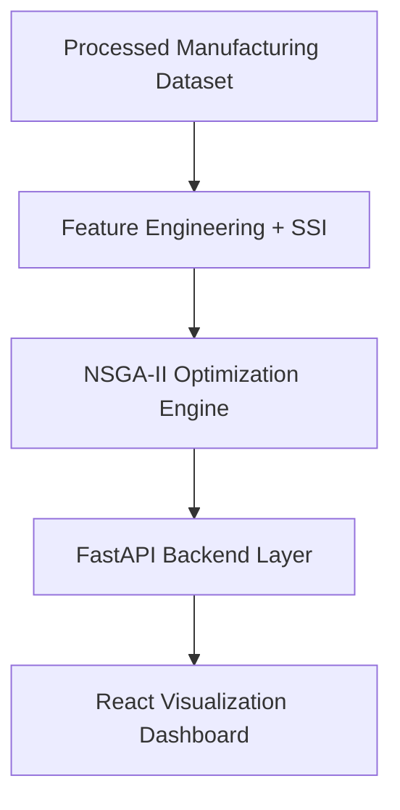

# 🚀 OmniGen: AI-Powered Manufacturing Optimizer

> **Optimization Engine for Process, Asset, and Carbon balancing.**

OmniGen is a next-generation decision support system for Industry 5.0. It leverages the **NSGA-II Genetic Algorithm** to solve the complex "Trilemma" of modern manufacturing: Maximizing **Yield**, Minimizing **Energy**, and Reducing **Carbon Footprint** in real-time.

---

## 📌 Problem Statement
Modern manufacturing generate large volumes of batch production data but face major challenges in:
* **Optimal Conditions:** Identifying the "perfect" state for specific batch types.
* **Conflicting Objectives:** Balancing cost, efficiency, and quality in real-time.
* **Actionable Insights:** Turning massive historical datasets into intelligent production decisions.
* **Visualization Gap:** Traditional systems lack AI-driven multi-objective decision support tools.

## 💡 Proposed Solution
OmniGen provides an intelligent optimization layer that acts as a "Digital Brain" for existing machinery:
* **Golden Production Signatures:** Automated identification of optimal historical batch states.
* **Smart Similarity Index (SSI):** Proprietary scoring to measure live batch deviation from targets.
* **NSGA-II Optimization:** Multi-objective genetic algorithms for finding the **Pareto Optimal** state.
* **Interactive Dashboard:** Real-time visualization of the Pareto frontier and AI recommendations.

---

## 🏗 System Architecture

OmniGen is built on a modular, edge-ready stack designed for sub-second latency and high scalability.
# 🚀 OmniGen – AI Manufacturing Optimizer

## 📌 System Architecture



---

## 🛠 Tech Stack

### Frontend
- React 18
- Vite
- Tailwind CSS
- Recharts (Real-time analytics visualization)

### Backend
- FastAPI (High-performance Python API)
- Uvicorn (ASGI Server)

### Data Science
- Pandas
- NumPy
- Scikit-Learn

### Optimization
- PyMoDE / Custom NSGA-II implementation for multi-objective optimization

---

## 📂 Project Structure

```text
OmniGen/
├── frontend/             
│   ├── src/
│   │   ├── ParetoChart.jsx      
│   │   ├── Recommendations.jsx  
│   │   └── App.jsx              
│
├── backend/              
│   ├── src/
│   │   ├── api.py               
│   │   ├── nsga_optimizer.py    
│   │   ├── ssi_calculation.py   
│   │   └── golden_signature.py  
│   │
│   └── data/                    
│
└── README.md
```

---

## 🚀 Installation & Setup (Quick Start)

### 1️⃣ Clone the Repository

```bash
git clone https://github.com/Chrry-07/OmniGen.git
cd OmniGen
```

---

### 2️⃣ Start Backend Engine

```bash
cd backend
python -m venv venv
```

Activate virtual environment:

**Windows**
```bash
venv\Scripts\activate
```

**Mac/Linux**
```bash
source venv/bin/activate
```

Install dependencies:

```bash
pip install -r requirements.txt
```

Run backend:

```bash
uvicorn src.api:app --reload
```

API Docs:

```
http://127.0.0.1:8000/docs
```

---

### 3️⃣ Start Frontend Dashboard

```bash
cd ../frontend
npm install
npm run dev
```

Frontend runs at:

```
http://localhost:5173
```

---

## 📊 Key Innovations

### Pareto Frontier Analysis
Unlike traditional AI models that output a single prediction, OmniGen provides multiple optimal trade-offs between energy consumption and production yield.

### Zero-CapEx Feasibility
Designed to integrate with existing SCADA/PLC infrastructure via API without requiring additional hardware investments.

### Signature Stability
Ensures identified Golden Batches are consistent across multiple production cycles.

---

## 🎯 Future Roadmap

- Digital Twin Simulation
- Augmented Reality Operator Assistance
- Quantum-inspired Optimization Algorithms
- Real-time Industrial IoT Integration

---

## 👩‍💻 Team

**Tech4Change – Engineering for a Sustainable Future**

---

## 🌟 Vision

Transforming complex manufacturing datasets into intelligent, sustainable, and automated production intelligence systems.


